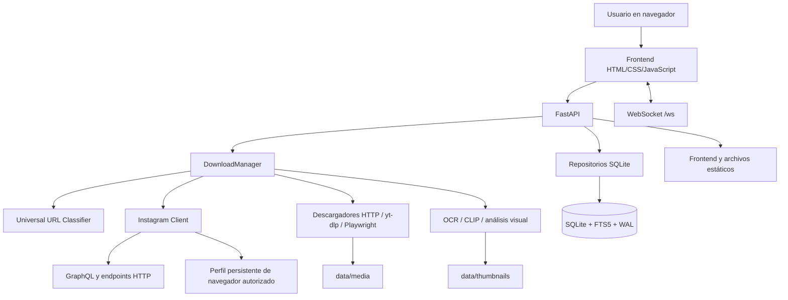

# Instagram Archiver

**Instagram Archiver** es una aplicación local para organizar, descargar, analizar y consultar contenido multimedia a partir de URLs. El sistema combina un backend asíncrono en Python con FastAPI, una interfaz web construida con HTML/CSS/JavaScript sin framework, una cola persistente en SQLite, análisis opcional mediante visión artificial y OCR, generación de miniaturas, búsqueda de texto completo y un flujo de diagnóstico para Instagram mediante una sesión autorizada y un navegador persistente.

El proyecto está orientado principalmente a **Windows 10/11**, aunque el backend utiliza tecnologías multiplataforma. La aplicación se ejecuta localmente, escucha por defecto en `127.0.0.1:8000` y sirve tanto la API como el frontend desde el mismo proceso.

> **Estado del proyecto:** funcional y en evolución. La ruta HTTP de Instagram puede recibir respuestas `403` o `404` aun cuando la sesión esté cargada. Para distinguir un problema del cliente HTTP de un problema de autorización real, el proyecto incluye una comprobación visible mediante navegador autorizado. Esta comprobación no intenta evadir controles de la plataforma ni falsificar la huella del cliente.

## Índice

- [Características principales](#características-principales)
- [Arquitectura](#arquitectura)
- [Tecnologías](#tecnologías)
- [Estructura del repositorio](#estructura-del-repositorio)
- [Requisitos del sistema](#requisitos-del-sistema)
- [Instalación en Windows](#instalación-en-windows)
- [Ejecución](#ejecución)
- [Configuración](#configuración)
- [Autenticación de Instagram](#autenticación-de-instagram)
- [Diagnóstico de Instagram](#diagnóstico-de-instagram)
- [Centro de descargas y estados](#centro-de-descargas-y-estados)
- [Flujo de una descarga](#flujo-de-una-descarga)
- [Base de datos](#base-de-datos)
- [API HTTP](#api-http)
- [WebSocket](#websocket)
- [Análisis de imágenes y OCR](#análisis-de-imágenes-y-ocr)
- [Búsqueda y biblioteca](#búsqueda-y-biblioteca)
- [Logs y diagnóstico operativo](#logs-y-diagnóstico-operativo)
- [Seguridad y privacidad](#seguridad-y-privacidad)
- [Mantenimiento](#mantenimiento)
- [Pruebas](#pruebas)
- [Solución de problemas](#solución-de-problemas)
- [Limitaciones conocidas](#limitaciones-conocidas)
- [Contribuciones](#contribuciones)
- [Licencia](#licencia)
- [Referencias](#referencias)

## Características principales

Instagram Archiver permite encolar URLs individuales o lotes de URLs, procesarlas mediante una cola persistente y visualizar el progreso en tiempo real. El sistema clasifica la URL antes de seleccionar el descargador correspondiente, de modo que un dominio genérico no debe ser tratado como Instagram, Twitter u otra red social por una coincidencia incorrecta.

La biblioteca local conserva posts, autores, archivos multimedia, miniaturas, etiquetas, resultados OCR, paletas de color, colecciones y notas. Los registros se guardan en SQLite con modo WAL, índices específicos y tablas FTS5 para permitir búsquedas rápidas sobre captions, hashtags, ubicaciones, tags y texto extraído de imágenes.

| Área | Capacidades disponibles |
|---|---|
| Descargas | Encolado individual y por lote, prioridades, pausa, reanudación, cancelación, reintentos y progreso. |
| Instagram | Login por usuario/contraseña o por `sessionid`, persistencia de sesión, estado visible, diagnóstico HTTP y fallback de navegador autorizado. |
| Sitios generales | Clasificación universal de URLs, `yt-dlp`, HTTP y Playwright para sitios que requieren navegación real. |
| Biblioteca | Posts, autores, medios, favoritos, notas, colecciones, tags, OCR, integridad de archivos y estadísticas. |
| IA y análisis | Tags mediante CLIP, OCR, detección de colores, miniaturas y análisis de imágenes. |
| Interfaz | Dashboard, cola en tiempo real, filtros de estado, biblioteca, búsqueda, ajustes y WebSocket. |
| Operación | Logs estructurados, SQLite WAL, scripts de limpieza y endpoints de salud. |

## Arquitectura

La aplicación sigue una arquitectura local de capas. FastAPI expone los endpoints y sirve los recursos estáticos; `DownloadManager` coordina la cola y los workers; los repositorios aíslan el acceso a SQLite; los servicios de descarga, IA y miniaturas procesan cada tarea; y el frontend consume la API mediante `api.js` y recibe actualizaciones mediante WebSocket.



El ciclo de vida se administra desde `backend/main.py`. Durante el arranque se crean los directorios de datos, se inicializa la base SQLite, se inicia el procesamiento de IA en segundo plano y se levanta el `DownloadManager`. Durante el cierre se detienen los workers y se liberan los recursos asociados.

## Tecnologías

| Componente | Tecnología | Uso dentro del proyecto |
|---|---|---|
| Backend | Python 3.11+ recomendado; compatible con Python 3.13 según el entorno objetivo | Lógica de aplicación y servicios. |
| API | FastAPI `0.115.x` | Endpoints REST, documentación OpenAPI y ciclo de vida. [1] |
| Servidor | Uvicorn | Ejecución ASGI de FastAPI. |
| Base de datos | SQLite con `aiosqlite` | Persistencia asíncrona, WAL, relaciones e índices. |
| Validación | Pydantic 2 | Modelos y validación de payloads. |
| Instagram | Instaloader, `httpx` y cliente propio | Sesión, metadatos, requests HTTP y clasificación de respuestas. [2] |
| Navegador | Playwright para Python | Comprobación visible y extracción autorizada desde un navegador persistente. [3] |
| Descarga multimedia | `yt-dlp` | Descarga de múltiples sitios compatibles. |
| HTML | BeautifulSoup y `readability-lxml` | Análisis de páginas HTML y extracción de contenido. |
| Imagen | Pillow y OpenCV headless | Validación, transformación, thumbnails y frames. |
| IA visual | PyTorch, Torchvision y CLIP | Etiquetado zero-shot y análisis visual. |
| OCR | EasyOCR | Extracción de texto de imágenes. |
| Frontend | HTML5, CSS3 y JavaScript ES modules | Interfaz sin framework ni bundler. |
| Tiempo real | WebSocket | Actualización de cola, progreso y estado operativo. |

Las versiones exactas de las dependencias deben mantenerse en el `requirements.txt` del repositorio que se publique. La copia auditada utilizada para preparar esta documentación contiene `start.bat`, que intenta instalar desde `requirements.txt`; si ese archivo no está presente en tu copia, debe agregarse antes de publicar o ejecutar una instalación limpia.

## Estructura del repositorio

```text
instagram-archiver/
├── backend/
│   ├── api/
│   │   ├── routes/
│   │   │   ├── downloads.py       # Cola, login de Instagram y acciones de tareas
│   │   │   ├── library.py         # Biblioteca, autores, tags y colecciones
│   │   │   ├── search.py          # Búsqueda, sugerencias, color y OCR
│   │   │   ├── settings.py        # Lectura, actualización y reset de ajustes
│   │   │   └── stats.py            # Salud, estadísticas, duplicados y mantenimiento
│   │   └── websocket.py            # Gestor de conexiones WebSocket
│   ├── database/
│   │   ├── connection.py          # Conexiones y pragmas SQLite
│   │   ├── migrations.py          # Migraciones y evolución del esquema
│   │   └── schema.sql             # Tablas, índices, FTS5, triggers y vistas
│   ├── models/                    # Modelos de entrada y dominio
│   ├── repositories/              # Acceso aislado a la base de datos
│   ├── services/
│   │   ├── ai/                   # CLIP, OCR y análisis visual
│   │   ├── downloader/            # Manager, Instagram y descargador universal
│   │   ├── settings_service.py   # Persistencia de configuración runtime
│   │   └── thumbnail_service.py  # Generación y validación de thumbnails
│   ├── utils/                     # Logs, archivos y utilidades
│   ├── config.py                  # Configuración centralizada
│   └── main.py                    # Entrada FastAPI y ciclo de vida
├── frontend/
│   ├── assets/
│   │   ├── css/                  # main.css, components.css y themes.css
│   │   └── js/
│   │       ├── components/       # Descargas, biblioteca, búsqueda y carousel
│   │       ├── utils/             # WebSocket y tema
│   │       ├── api.js             # Cliente HTTP del frontend
│   │       └── app.js             # Inicialización y lógica principal
│   └── index.html                 # Frontend servido por FastAPI
├── tests/
│   ├── integration/              # Pruebas de endpoints
│   ├── unit/                     # Repositorios y utilidades
│   └── conftest.py
├── tools/
│   ├── clean_corrupt_files.py    # Limpieza de archivos corruptos
│   └── wipe_and_restart.py        # Reinicio destructivo del entorno local
├── data/                          # Generado en runtime; no publicar
├── index.html                     # Copia raíz sincronizada del frontend
├── pytest.ini                     # Configuración de pytest
├── start.bat                      # Arranque automático para Windows
├── .gitignore
└── README.md
```

La carpeta `data/` se crea automáticamente y contiene información potencialmente sensible. No debe subirse a GitHub porque puede incluir una base de datos local, medios descargados, logs, perfiles de navegador y credenciales de sesión.

## Requisitos del sistema

Se recomienda Windows 10 u 11 con Python 3.11 o superior. El objetivo actual también contempla Python 3.13. Para utilizar el diagnóstico de navegador y los sitios que requieren JavaScript, Playwright necesita tener instalado Chromium mediante un paso adicional después de instalar las dependencias. La disponibilidad de PyTorch, CLIP y EasyOCR puede requerir más memoria y tiempo de instalación que el núcleo de la aplicación.

| Requisito | Recomendación |
|---|---|
| Sistema operativo | Windows 10/11 para el flujo documentado; Linux y macOS pueden funcionar con ajustes menores. |
| Python | 3.11+; el entorno objetivo utiliza 3.13. |
| Navegador | Chromium, Chrome o Thorium para la interfaz; Playwright Chromium para el diagnóstico automatizado visible. |
| Memoria | 8 GB como base práctica si se habilitan IA, OCR y procesamiento de video. |
| Espacio | Depende de la biblioteca descargada; `data/media` puede crecer rápidamente. |
| Red | Conexión necesaria para descargar contenido y consultar servicios externos. |

## Instalación en Windows

Cloná el repositorio y abrí una terminal en su raíz. El script `start.bat` cambia al directorio del proyecto, verifica que el frontend y el backend incluyan el soporte de `sessionid`, crea un entorno virtual si no existe, comprueba FastAPI e intenta instalar `requirements.txt` cuando corresponde.

```bat
git clone <URL_DEL_REPOSITORIO>
cd instagram-archiver
start.bat
```

Para realizar la instalación manual, el flujo recomendado es el siguiente:

```bat
python -m venv venv
venv\Scripts\activate
python -m pip install --upgrade pip
python -m pip install -r requirements.txt
python -m playwright install chromium
```

Si el proyecto se ejecuta con Python 3.13, conviene actualizar `pip`, `setuptools` y `wheel` antes de instalar PyTorch, OpenCV, EasyOCR y CLIP. Algunas dependencias de IA pueden variar según la versión de Python, la arquitectura y el soporte de CPU/GPU disponible.

## Ejecución

El arranque normal en Windows se realiza con:

```bat
start.bat
```

También se puede iniciar directamente desde la raíz del repositorio:

```bat
python -m backend.main
```

La aplicación queda disponible en [http://127.0.0.1:8000](http://127.0.0.1:8000). La documentación interactiva de FastAPI se encuentra en `/api/docs` y la documentación ReDoc en `/api/redoc`.

```text
Interfaz:       http://127.0.0.1:8000/
Swagger:        http://127.0.0.1:8000/api/docs
ReDoc:          http://127.0.0.1:8000/api/redoc
WebSocket:      ws://127.0.0.1:8000/ws
Media:          http://127.0.0.1:8000/media/
Thumbnails:     http://127.0.0.1:8000/thumbnails/
```

El servidor está configurado por defecto con host `127.0.0.1`, puerto `8000`, un worker y `reload=False`. Mantener un único worker simplifica la compatibilidad con SQLite y permite conservar un estado de sesión y una cola coherentes dentro del proceso.

## Configuración

La configuración central se encuentra en `backend/config.py` y se organiza mediante dataclasses. Los directorios se crean al importar el módulo si no existen.

| Configuración | Valor predeterminado | Propósito |
|---|---:|---|
| `server.host` | `127.0.0.1` | Interfaz de red local. |
| `server.port` | `8000` | Puerto HTTP y WebSocket. |
| `server.workers` | `1` | Un proceso para mantener coherencia con SQLite y la cola. |
| `database.path` | `data/db/archiver.db` | Base SQLite. |
| `downloader.max_retries` | `3` | Reintentos generales. |
| `downloader.request_timeout_s` | `60` | Timeout de requests. |
| `downloader.min_delay_between_requests_s` | `20` | Límite inferior entre requests de Instagram. |
| `downloader.max_delay_between_requests_s` | `30` | Límite superior entre requests de Instagram. |
| `downloader.min_delay_between_posts_s` | `30` | Pausa mínima entre publicaciones. |
| `downloader.max_delay_between_posts_s` | `60` | Pausa máxima entre publicaciones. |
| `downloader.session_pause_every_n_posts` | `10` | Pausa periódica de sesión. |
| `downloader.session_pause_min_s` | `60` | Mínimo de pausa periódica. |
| `downloader.session_pause_max_s` | `180` | Máximo de pausa periódica. |
| `thumbnail.width` | `480` | Ancho de thumbnail. |
| `thumbnail.height` | `480` | Alto de thumbnail. |
| `thumbnail.format` | `WEBP` | Formato generado. |
| `ai.enabled` | `true` | Habilitación del procesamiento de IA. |
| `ai.batch_size` | `4` | Tamaño de lote para análisis visual. |
| `search.max_results_per_page` | `50` | Resultados máximos de búsqueda. |

Los intervalos de Instagram son un control conservador de carga y no deben interpretarse como una técnica para evadir mecanismos de la plataforma. Ante `429`, se debe respetar `Retry-After`; ante `401`, redirecciones, checkpoint o bloqueos, la aplicación debe detenerse y solicitar intervención.

## Autenticación de Instagram

El modal de login ofrece dos métodos: **Usuario y contraseña** y **Usar sessionid**. Para el método `sessionid`, el nombre de usuario es opcional. La cuenta real se determina a partir de la sesión validada por Instagram, por lo que el texto escrito en el campo de usuario no debe utilizarse para sustituir la identidad confirmada por el `sessionid`.

El flujo recomendado es el siguiente:

1. Abrí el Centro de Descargas y seleccioná el login de Instagram.
2. Elegí **Usar sessionid**.
3. Pegá únicamente el valor de `sessionid` de una sesión propia y autorizada.
4. Iniciá sesión.
5. Confirmá en el indicador del encabezado que aparece la cuenta validada y el estado activo.

La aplicación persiste la sesión en el directorio `data/`, según la implementación activa del cliente. Ese archivo y cualquier perfil de navegador deben considerarse secretos operativos. No se deben incluir en commits, capturas, logs, reportes ni issues públicos.

> **Importante:** un `sessionid` presente demuestra que la aplicación tiene una credencial de sesión cargada. No garantiza que cada endpoint HTTP de Instagram autorice cada request. La aplicación diferencia entre sesión cargada, sesión inválida, redirección, denegación del endpoint, rate limit, error de servidor y privacidad confirmada.

## Diagnóstico de Instagram

El cliente de Instagram intenta primero la ruta HTTP configurada para metadatos. Si GraphQL o el fallback HTTP no pueden devolver información útil, la aplicación puede utilizar un **perfil persistente de navegador autorizado** para comprobar la misma URL desde una navegación visible. Esta ruta existe para diferenciar un rechazo del cliente HTTP de un problema real de acceso al contenido.

El perfil de navegador se guarda dentro de `data/instagram_browser_profile`, no se incluye en el repositorio y no debe compartirse. Si el navegador solicita login, el usuario debe iniciar sesión manualmente en esa ventana autorizada. El sistema no debe imprimir cookies, tokens, HTML completo ni valores de `sessionid`.

Desde el Centro de Descargas se puede utilizar **Probar en navegador** con una URL de Instagram. Los resultados se interpretan así:

| Resultado | Interpretación |
|---|---|
| `browser_loaded` | La publicación se carga en el navegador autorizado; el problema probablemente está en el endpoint HTTP o en el cliente de requests. |
| `login_required` | El perfil persistente del navegador no tiene una sesión activa. |
| `private_signal` | La página mostró una señal explícita de privacidad. |
| `not_found` | Instagram indicó que el recurso no está disponible o fue eliminado. |
| `blocked` | La navegación mostró checkpoint, CAPTCHA, challenge o bloqueo. |
| Sin medios | La página cargó, pero no se identificó una URL multimedia utilizable. |

### Interpretación de códigos HTTP

| Código o señal | Estado interno recomendado | Significado operativo |
|---|---|---|
| `200` | Éxito | La respuesta se procesó correctamente. |
| `400` | `bad_request` | La petición o los parámetros no son válidos. |
| `401` | `invalid_session` | Instagram no acepta la sesión o esta expiró. |
| Redirección al login | `redirect_to_login` | La navegación requiere autenticación nuevamente. |
| `403` sin señal explícita | `access_denied` | Instagram rechazó esa solicitud; no demuestra por sí solo que el post sea privado. |
| `404` explícito | `not_found` | El recurso no está disponible según esa ruta. |
| `429` o señal inequívoca | `rate_limited` | Se excedió un límite; debe respetarse `Retry-After` si existe. |
| `500`/`503` | `server_error` | Fallo del servidor o del endpoint; no debe convertirse automáticamente en rate limit. |
| Señal explícita de privacidad | `private` | Solo debe utilizarse cuando la respuesta o la página confirman privacidad. |

El patrón `403` en GraphQL seguido de `404` en un fallback HTML debe registrarse como `access_denied` principal y `not_found` secundario, no como evidencia suficiente de que el post es privado. Los logs de diagnóstico deben indicar método, status, content type y evidencia resumida, pero nunca el cuerpo de respuesta ni secretos.

## Centro de descargas y estados

Cada URL se convierte en una tarea persistida en `download_tasks`. La interfaz recibe la cola inicial mediante HTTP y las actualizaciones posteriores mediante WebSocket y polling. El selector de estado permite consultar tanto tareas activas como estados terminales e históricos.

| Estado | Descripción |
|---|---|
| `queued` | En cola, esperando un worker. |
| `analyzing` | Clasificando URL o preparando metadatos. |
| `downloading` | Descargando uno o más archivos. |
| `processing_ai` | Ejecutando análisis visual u OCR. |
| `generating_thumbnails` | Generando o regenerando miniaturas. |
| `saving` | Persistiendo post, autor, medios y tags. |
| `completed` | Tarea finalizada correctamente. |
| `error` | Tarea finalizada con error. |
| `paused` | Tarea detenida temporalmente por el usuario o por control de cola. |
| `cancelled` | Tarea cancelada y no reanudable sin volver a encolarla. |

El filtro **Activas** muestra tareas no terminales. Las opciones históricas como **Completadas**, **Canceladas** y **Con error** consultan el historial reciente sin eliminar la vista de tareas activas.

## Flujo de una descarga

El flujo comienza cuando el usuario envía una URL individual o un lote. El `DownloadManager` valida y clasifica la URL, crea una tarea con prioridad, la persiste en SQLite y la coloca en la cola interna.

```text
URL recibida
    ↓
Validación y clasificación
    ↓
Tarea queued
    ↓
Extracción de metadatos
    ↓
Descarga de imagen, video o carrusel
    ↓
Validación e integridad de archivos
    ↓
Miniaturas, OCR, tags y análisis visual opcionales
    ↓
Persistencia de autor, post, media y relaciones
    ↓
Tarea completed o error
```

Para Instagram, el cliente conserva el diagnóstico del request. Si la respuesta HTTP no ofrece datos suficientes y el fallback de navegador está habilitado, la página puede abrirse en el perfil persistente autorizado. La descarga final debe utilizar el contexto de sesión adecuado para no perder autorización después de obtener los metadatos.

Para URLs no sociales, `UniversalDownloader` debe mantener la clasificación `generic` cuando el dominio no coincide con un patrón social conocido. Existe una defensa adicional para evitar que un dominio genérico se enrute por error al descargador de Twitter.

## Base de datos

SQLite se inicializa en `data/db/archiver.db` con modo WAL, foreign keys, cache y timeout de escritura. El esquema se encuentra en `backend/database/schema.sql` y contiene tablas normalizadas para autores, posts, medios, tags, OCR, colores, colecciones, tareas, logs y eventos.

| Grupo | Tablas principales |
|---|---|
| Biblioteca | `authors`, `posts`, `media_files` |
| Etiquetado | `tags`, `post_tags`, `media_tags` |
| Análisis | `ocr_results`, `color_palettes` |
| Organización | `collections`, `collection_posts` |
| Operación | `download_tasks`, `download_logs`, `app_history` |
| Métricas | `stats_snapshots` |
| Búsqueda | `posts_fts`, `ocr_fts`, `tags_fts` |

Las tablas FTS5 y sus triggers mantienen índices de texto completo sincronizados con posts, OCR y tags. La vista `v_library_health` resume posts, archivos, metadatos faltantes, bytes totales y tareas fallidas.

## API HTTP

La API está disponible bajo el prefijo `/api` y FastAPI publica el contrato OpenAPI en `/api/docs`. Los endpoints más relevantes son los siguientes.

### Descargas y cola

| Método | Ruta | Descripción |
|---|---|---|
| `POST` | `/api/downloads` | Encola una URL individual. |
| `POST` | `/api/downloads/batch` | Encola varias URLs. |
| `GET` | `/api/downloads/queue` | Devuelve resumen y tareas activas. |
| `GET` | `/api/downloads/history` | Devuelve historial reciente. |
| `GET` | `/api/downloads/errors` | Devuelve tareas con error. |
| `GET` | `/api/downloads/history/events` | Devuelve eventos recientes. |
| `GET` | `/api/downloads/{task_id}` | Consulta una tarea. |
| `GET` | `/api/downloads/{task_id}/logs` | Consulta logs detallados de una tarea. |
| `POST` | `/api/downloads/{task_id}/pause` | Pausa una tarea. |
| `POST` | `/api/downloads/{task_id}/resume` | Reanuda una tarea. |
| `POST` | `/api/downloads/{task_id}/cancel` | Cancela una tarea. |
| `POST` | `/api/downloads/pause-all` | Pausa tareas en curso o en cola. |
| `POST` | `/api/downloads/resume-queue` | Reanuda tareas interrumpidas. |
| `POST` | `/api/downloads/cancel-all` | Cancela tareas en cola. |
| `POST` | `/api/downloads/clear-history` | Elimina tareas terminales del historial. |
| `POST` | `/api/downloads/reset` | Reinicia datos multimedia, base y logs; usar con cuidado. |

### Instagram

| Método | Ruta | Descripción |
|---|---|---|
| `POST` | `/api/downloads/instagram/login` | Login por contraseña o `sessionid`. |
| `POST` | `/api/downloads/instagram/logout` | Cierra la sesión de Instagram en la aplicación. |
| `GET` | `/api/downloads/instagram/status` | Devuelve estado, cuenta validada y evidencia resumida. |
| `POST` | `/api/downloads/instagram/browser-probe` | Prueba una URL mediante navegador persistente autorizado. |
| `POST` | `/api/downloads/instagram/browser-close` | Cierra el contexto de navegador de diagnóstico. |

El payload de login por `sessionid` tiene esta forma conceptual:

```json
{
  "method": "sessionid",
  "sessionid": "<SESSIONID_PROPIO>",
  "username": ""
}
```

El campo `username` puede omitirse o quedar vacío en ese método. No se deben pegar valores reales en issues, README, capturas ni comandos compartidos.

### Biblioteca, búsqueda y configuración

| Grupo | Rutas principales |
|---|---|
| Biblioteca | `/api/library/posts`, `/api/library/posts/recent`, `/api/library/posts/timeline`, `/api/library/posts/{post_id}`, `/api/library/domains` |
| Autores | `/api/library/authors`, `/api/library/authors/{username}/posts` |
| Tags | `/api/library/tags`, `/api/library/posts/{post_id}/tags` |
| Colecciones | `/api/library/collections`, `/api/library/collections/{collection_id}/posts` |
| Favoritos | `/api/library/favorites`, `PATCH /api/library/posts/{post_id}/favorite` |
| Notas | `PATCH /api/library/posts/{post_id}/notes` |
| Borrado | `DELETE /api/library/posts/{post_id}`, `DELETE /api/library/media/{media_id}` |
| Búsqueda | `GET /api/search`, `/api/search/suggestions`, `/api/search/by-color`, `/api/search/by-ocr` |
| Ajustes | `GET/POST /api/settings`, `POST /api/settings/reset` |

### Estadísticas y mantenimiento

| Método | Ruta | Descripción |
|---|---|---|
| `GET` | `/api/stats/library` | Estadísticas de biblioteca. |
| `GET` | `/api/stats/system` | CPU, memoria, disco y estado del proceso. |
| `GET` | `/api/stats/health` | Estado general e integridad. |
| `GET` | `/api/stats/health/empty-posts` | Detecta posts sin medios. |
| `POST` | `/api/stats/health/fix-empty-posts` | Corrige posts vacíos según la lógica del servicio. |
| `GET` | `/api/stats/duplicates` | Consulta duplicados. |
| `POST` | `/api/stats/health/regenerate-thumbnails` | Regenera miniaturas y limpia referencias inválidas. |
| `POST` | `/api/stats/health/reindex-fts` | Reconstruye índices FTS. |
| `GET` | `/api/stats/queue/summary` | Resumen de estados de la cola. |

## WebSocket

El endpoint `ws://127.0.0.1:8000/ws` mantiene la conexión de tiempo real de la interfaz. Al conectarse, el servidor envía el resumen inicial de la cola. El cliente puede enviar `ping` y recibe `pong`; el `DownloadManager` utiliza el gestor WebSocket para emitir cambios de estado y progreso.

El WebSocket no reemplaza la persistencia. Si el navegador se desconecta, el frontend puede recuperar la cola y el historial mediante los endpoints HTTP.

## Análisis de imágenes y OCR

La capa de IA es opcional desde el punto de vista funcional, pero está habilitada por defecto en `AIConfig`. El procesamiento puede incluir tags zero-shot mediante CLIP, OCR con EasyOCR, extracción de colores y análisis de imágenes. El diseño utiliza un worker de IA y batches pequeños para reducir el consumo de CPU.

Los resultados se relacionan con posts y archivos multimedia mediante `post_tags`, `media_tags`, `ocr_results` y `color_palettes`. Los tags pueden proceder de IA, hashtags, OCR, color u origen manual, y cada resultado de IA puede conservar una confianza numérica.

Si el equipo no dispone de recursos suficientes, conviene deshabilitar temporalmente IA desde la configuración o ajustar el tamaño de batch antes de procesar una biblioteca grande. La descarga y la biblioteca principal no deberían depender de que cada módulo de análisis finalice correctamente.

## Búsqueda y biblioteca

La biblioteca consulta posts, autores, medios, tags, favoritos, colecciones y eventos. Las tablas FTS5 permiten buscar captions, hashtags, ubicaciones, tags y texto OCR sin recorrer manualmente todos los archivos. Las vistas de biblioteca también pueden mostrar integridad, miniaturas faltantes y archivos no verificados.

Los medios se sirven desde `/media` y las miniaturas desde `/thumbnails`. Esas rutas son locales y no deben exponerse directamente a Internet sin una capa adicional de autenticación y control de acceso.

## Logs y diagnóstico operativo

Los logs se almacenan en `data/logs`. El logger de backend registra el arranque, la inicialización de base de datos, el estado del `DownloadManager`, los eventos de cola, los resultados del cliente de Instagram y los fallos de tareas.

Para diagnosticar una descarga, primero consultá la tarea y luego sus logs:

```text
GET /api/downloads/<TASK_ID>
GET /api/downloads/<TASK_ID>/logs
```

En Instagram se deben correlacionar timestamp, URL normalizada o shortcode, método (`graphql`, fallback o navegador), status HTTP, content type, estado de sesión y evidencia resumida. No se debe registrar el cuerpo de la respuesta ni ninguna cookie.

Un diagnóstico útil debe distinguir estos casos:

```text
active + http_403       = sesión cargada; endpoint rechazó la solicitud
invalid_session         = Instagram no acepta la sesión
redirect_to_login       = navegación requiere autenticación
rate_limited            = 429 o señal inequívoca de límite
server_error            = 500/503 u otro fallo del servidor
private_signal          = privacidad confirmada explícitamente
not_found               = 404 explícito o recurso no disponible
```

## Seguridad y privacidad

Instagram Archiver procesa credenciales de sesión y archivos potencialmente privados. El uso previsto es local y autorizado. El usuario debe utilizar únicamente cuentas, URLs y contenidos sobre los que tenga permiso de acceso y archivado.

| Riesgo | Medida recomendada |
|---|---|
| Exposición de `sessionid` | No incluirlo en logs, commits, capturas, issues, backups públicos ni mensajes. |
| Exposición de contraseña | Preferir `sessionid` propio y no persistir contraseñas en texto plano. |
| Perfil de navegador | Mantener `data/instagram_browser_profile` local y fuera de Git. |
| Biblioteca sensible | No publicar `data/media`, `data/db` ni `data/logs`. |
| Servidor local | Mantener `127.0.0.1` salvo que se agregue autenticación y firewall. |
| Rate limiting | Respetar `Retry-After`, reducir concurrencia y detenerse ante bloqueos. |
| Automatización | No falsificar huellas ni intentar evadir challenges, CAPTCHA o WAF. |
| Limpieza destructiva | Revisar antes de ejecutar `wipe_and_restart.py` o `/api/downloads/reset`. |

El `.gitignore` debe cubrir al menos `data/`, `venv/`, `.venv/`, `__pycache__/`, `*.pyc`, `.env` y cualquier archivo de sesión. Antes de publicar el repositorio, conviene revisar el historial de Git para asegurar que ningún secreto haya sido commiteado anteriormente.

## Mantenimiento

El endpoint `POST /api/stats/health/regenerate-thumbnails` permite reparar thumbnails faltantes y limpiar referencias de archivos corruptos u huérfanos según la lógica actual. El endpoint `POST /api/stats/health/reindex-fts` reconstruye los índices de búsqueda cuando la biblioteca presenta resultados incompletos.

Los scripts de `tools/` deben ejecutarse desde la raíz del proyecto y con la aplicación detenida cuando realicen operaciones destructivas o modificaciones masivas. Antes de limpiar una biblioteca, realizá una copia de seguridad de `data/db`, `data/media` y `data/thumbnails`.

## Pruebas

El repositorio incluye pruebas unitarias para repositorios y utilidades, además de pruebas de integración para endpoints. El flujo estándar es:

```bat
venv\Scripts\activate
python -m pytest
```

Para ejecutar una categoría concreta:

```bat
python -m pytest tests\unit -q
python -m pytest tests\integration -q
```

Antes de empaquetar una versión, también conviene comprobar la sintaxis de todos los módulos y scripts:

```bat
python -m compileall backend tests tools
node --check frontend\assets\js\app.js
node --check frontend\assets\js\api.js
node --check frontend\assets\js\components\download-center.js
```

La prueba de navegador de Instagram debe ejecutarse manualmente desde la interfaz con una URL autorizada. No debe incorporarse como prueba automática contra una cuenta real en CI.

## Solución de problemas

### `start.bat` indica que falta `requirements.txt`

El script de arranque intenta ejecutar `pip install -r requirements.txt` cuando no encuentra FastAPI. Verificá que `requirements.txt` esté en la raíz del repositorio y que el entorno virtual haya sido creado correctamente.

### El navegador muestra una versión vieja del frontend

Realizá una recarga forzada con `Ctrl+F5`, cerrá la pestaña anterior y verificá que las referencias de cache-busting de `app.js`, `api.js`, `download-center.js` y `components.css` correspondan a la versión publicada. La copia servida por FastAPI es `frontend/index.html`.

### El login por `sessionid` devuelve `401`

El valor puede estar vencido, pertenecer a otra sesión o haber sido copiado incompleto. No pegues espacios adicionales ni compartas el valor. El endpoint debe devolver el usuario confirmado por Instagram, no el nombre escrito arbitrariamente en el formulario.

### La cuenta aparece activa pero Instagram devuelve `403`

`state=active` significa que existe una sesión cargada y validada previamente; no significa que el endpoint concreto autorice cada request. Revisá `last_fetch_reason` y `last_fetch_evidence`. Si el error es `access_denied` y el navegador autorizado carga la publicación, el problema está probablemente en la ruta HTTP o en sus requisitos de contexto. Si el navegador muestra login, checkpoint o bloqueo, el problema requiere intervención en ese contexto.

### Aparece un `429`

Detené el procesamiento, respetá el valor `Retry-After` y no relances manualmente muchas tareas. La configuración del proyecto mantiene una concurrencia de Instagram reducida y pausas conservadoras, pero ningún intervalo garantiza que una plataforma externa acepte todas las solicitudes.

### La tarea queda en `error` después de descargar un HTML

Verificá que el descargador no haya guardado una página de error como si fuera una imagen o video. Ejecutá el diagnóstico de salud y la regeneración de thumbnails. Consultá los logs de la tarea para identificar el status, content type y evidencia registrada.

### El WebSocket no conecta

Confirmá que la aplicación esté corriendo en `127.0.0.1:8000`, que el navegador no esté usando un HTML antiguo y que no exista otro proceso ocupando el puerto. La cola también puede consultarse por `GET /api/downloads/queue` aunque WebSocket esté desconectado.

## Limitaciones conocidas

La disponibilidad de contenido de Instagram depende de respuestas y políticas de un servicio externo. Una sesión válida no garantiza acceso permanente a todos los endpoints. Los formatos internos de Instagram pueden cambiar, y una respuesta `403` no contiene necesariamente información suficiente para concluir que una publicación es privada.

El fallback de navegador es una ruta de comprobación y recuperación autorizada, no una garantía de descarga universal. Si la página requiere login, checkpoint, CAPTCHA, challenge o interacción adicional, el usuario debe completar el flujo en la ventana visible y volver a probar. El sistema no debe intentar sortear esas protecciones.

Los modelos de IA aumentan el consumo de CPU, memoria y disco. En máquinas con recursos limitados, la cola puede tardar más en pasar de `downloading` a `processing_ai`, `generating_thumbnails` y `saving`.

## Contribuciones

Las contribuciones deben mantener la separación entre API, servicios, repositorios y frontend. Toda modificación que cambie estados de tareas debe actualizar simultáneamente el esquema, el repositorio, el endpoint, el WebSocket y el filtro del frontend.

Antes de abrir un pull request, ejecutá las pruebas, validá la sintaxis, revisá que no se incluyan datos locales y comprobá que ningún log pueda imprimir contraseñas, cookies, tokens o `sessionid`. Los issues públicos no deben contener credenciales ni URLs privadas.

Un flujo recomendado es:

```bash
git checkout -b feature/nombre-del-cambio
python -m pytest
python -m compileall backend tests tools
git diff --check
git status
```

## Licencia

Este repositorio no declara una licencia de software en la copia documentada. Si se publica en GitHub, agregá un archivo `LICENSE` con la licencia elegida antes de aceptar contribuciones externas o distribuir el proyecto. La ausencia de un archivo de licencia no equivale a una autorización general para reutilizar el código.

El usuario de la aplicación es responsable de respetar los términos de uso de Instagram, las leyes aplicables, los derechos de autor y los permisos correspondientes sobre el contenido archivado.

## Referencias

[1]: https://fastapi.tiangolo.com/ "FastAPI Documentation"
[2]: https://instaloader.github.io/ "Instaloader Documentation"
[3]: https://playwright.dev/python/docs/intro "Playwright Python Documentation"
[4]: https://docs.python.org/3/ "Python Documentation"
[5]: https://www.sqlite.org/docs.html "SQLite Documentation"
[6]: https://www.uvicorn.org/ "Uvicorn Documentation"
[7]: https://github.com/yt-dlp/yt-dlp "yt-dlp Repository"
[8]: https://github.com/openai/CLIP "OpenAI CLIP Repository"
[9]: https://github.com/JaidedAI/EasyOCR "EasyOCR Repository"

---

**Autoría documental:** Manus AI  
**Proyecto:** Instagram Archiver  
**Formato:** Markdown compatible con GitHub
